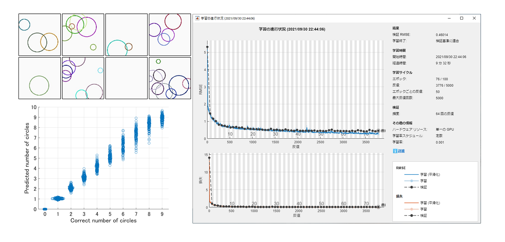

# 画像を入力とした深層ニューラルネットワークに基づく回帰のMATLAB実装

## なぜ画像の回帰を？
MATLABのDeep Learning Toolboxで利用する[imageDatastore](https://jp.mathworks.com/help/matlab/ref/matlab.io.datastore.imagedatastore.html)が分類問題にのみ対応している．具体的には，回帰を行うために出力層に[regressionLayer](https://jp.mathworks.com/help/deeplearning/ref/regressionlayer.html?s_tid=doc_ta)をつなげたネットワークにimageDatastoreを入力するとエラーがでる．
そのため，[trainNetwork](https://jp.mathworks.com/help/deeplearning/ref/trainnetwork.html?s_tid=doc_ta)の入力は'net = trainNetwork(imds,layers,options)'ではなく'net = trainNetwork(X,Y,layers,options)'や'net = trainNetwork(tbl,layers,options)'で入力する必要がある．

例えば画像のデータ拡張は[imageDataAugmenter](https://jp.mathworks.com/help/deeplearning/ref/imagedataaugmenter.html)と[augmentedImageDatastore](https://jp.mathworks.com/help/deeplearning/ref/augmentedimagedatastore.html?searchHighlight=augmentedI%E2%80%8BmageDatast%E2%80%8Bore&s_tid=srchtitle)を用いて実装できるが，imageDatastoreが回帰問題に対応していないことから，これらも利用できない．

今回，自前で画像のリサイズ，グレイスケール化，及びデータ拡張（左右・上下の反転，回転）を実装したので，公開しておく．

## 必要なもの
- MATLAB R2021aかより新しいもの
- Deep Learning Toolbox R2021aかより新しいもの
- 10GB以上のメインメモリ
- できればGPU

## 回帰問題の種類
5000枚の100x100のカラー画像があり，各画像には様々な色・大きさ・位置の円が0～9個描かれている（各500枚ずつ）．中には円の一部が画像からはみ出して見切れているものもある．この画像を入力とし，「何個の円があるか」を整数ではなく実数で回帰問題として予測するDNN（具体的には畳み込み層を用いているのでCNN）を実装している．

## データの分割と拡張
画像のカラー情報はグレイスケール化し，さらに画像サイズを50x50にリサイズすることで，1枚が50x50x1となるように圧縮している．

5000枚中の80%（4000枚）を開発データとし，残りの20%（1000枚）を評価データとする．さらに開発データ中の80%（3200枚）を学習データとし，残りの20%（800枚）を検証データする．いずれも3200枚の学習データには，上下・左右の反転と90・180・270度回転によるデータ拡張を適用し，8倍（25600枚）にデータ拡張して学習する．

## ネットワークの構造
VGG16を参考に，「畳み込み＋ReLU，畳み込み＋ReLU，プーリング」を4セット繰り返した後，3層の全結合層をつなげて1次元のスカラーを予測する．